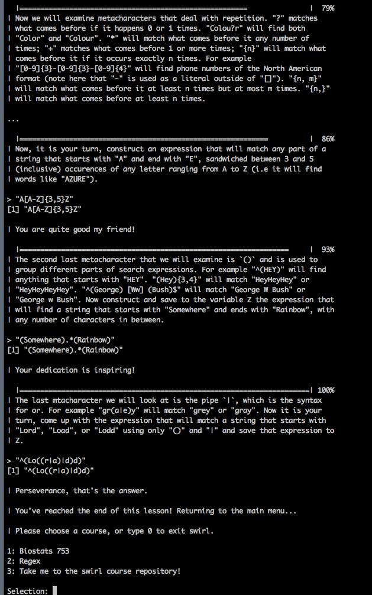
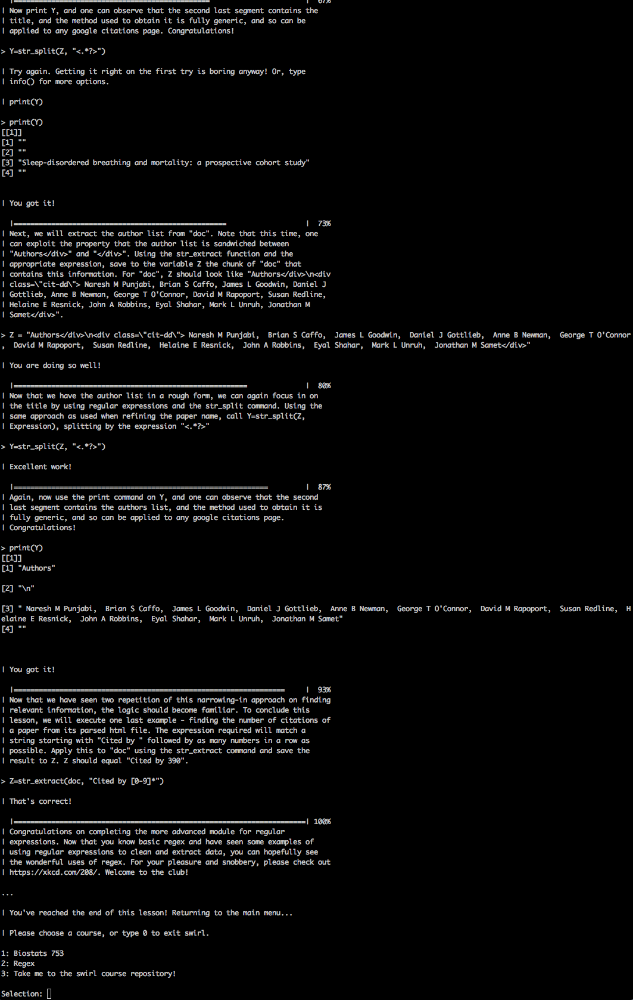

---
output:
  word_document: default
---
--
title: "Doing Data Science -- Assignment 6 "
author: "Travis Deason"
date: "Oct 11th 2017"
output:  word_document
---

# MSDS 6306 Live session unit 06 assignment
* Due: No late acceptance; 1 week from the live secession

```{r, echo=FALSE, message=FALSE}
rm( list = ls()); cat("\014")  # Clear environment
```

##Calculation Questions (using R) - Use R to calculate the following:
* NOTE: Submit a word file with the evidence that completes Regex and take its screenshot that shows the 100% completeness.
### 1. (100%) Install Swirl Regex at RStudio

```{r, echo=FALSE, message=FALSE}
#install.packages("fields")
#install_course_github("JMF47", "swirl_regex", multi=T)
#swirl()
```


## Then, you need to select Regex number (#2 in the instructor’s swirl environment. But you should have your number given for Regex in the swirl)
>* 1: R Programming

>* 2: Regex

## Select and complete topics 1 and 2: Regular Expression. Then, take the screenshots of the 100% completeness to submit.



